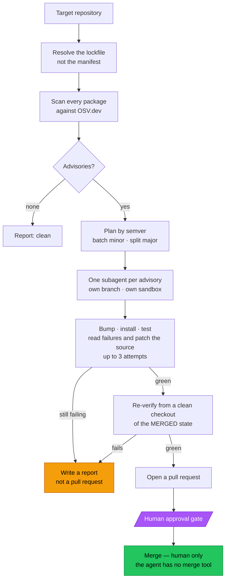

# Outsmart

Upgrades your dependencies and fixes what the upgrade breaks.

Dependabot opens the PR and walks away. Outsmart stays until the tests are green.

---

## The problem

A security advisory lands on a package three levels deep in your tree. The fix
is a major version bump. The bump breaks your build. Now it's your afternoon.

Detection is solved — Dependabot, `npm audit` and OSV all find the advisory.
**Repair is not.** The differentiator here is that Outsmart runs the tests,
reads the failure, patches the source, and re-verifies before it asks you for
anything.

## The flow



Two steps in that diagram are the ones that matter, and both are about not
trusting the agent: the **retry cap** (a report is a valid outcome, a false
green is not) and the **re-verify against the merged state**, explained below.

## How it works

1. **Resolve the real tree.** Advisories live in the lockfile, not the
   manifest — `^3.13.1` resolves to a patched version and finds nothing.
   Outsmart resolves the tree and scans every package in it, including
   transitive ones, against OSV.dev.
2. **Plan by semver.** Patch and minor fixes batch into one change; every major
   gets its own, because majors break APIs.
3. **Fan out.** One subagent per advisory, each on its own branch in its own
   sandbox.
4. **Repair.** Bump, install, run the suite. If it breaks, read the actual
   error and fix the source. After three failed attempts the worker stops and
   writes a report — a report is a valid outcome, a false green is not.
5. **Re-verify from clean.** The worker's claim of success is discarded. The
   suite and the advisory scan are re-run from a fresh checkout of what `main`
   will look like *after* the merge.
6. **Stop.** A pull request is opened and the agent waits. It cannot merge —
   `merge_pull_request` is not in its toolset.

### Why "after the merge" and not "on the branch"

Three subagents each produced a green branch. Git merged two of them with no
conflict, and the result had two `"overrides"` keys in `package.json`. JSON
keeps the last one, so a HIGH-severity fix silently disappeared — with passing
tests and a clean diff.

Three correct agents, one wrong result. No per-branch check can catch that,
which is why verification runs against the merged state.

## Best Use of TrueForge — where each capability is exercised

The track names six things. Here is where each one lives, so you can check
rather than take my word for it.

| Capability | Where | Verify it |
|---|---|---|
| **MCP** | GitHub connector: reads manifests, forks, creates branches, opens PRs | `agents/outsmart.json` → `mcp_servers` |
| **Sandbox** | every install, test run and repair executes in a bubblewrap sandbox; model and MCP credentials never enter it | `config.sandbox.enabled` |
| **Approval gate** | writes pause for a human, and `merge_pull_request` is removed from the agent's toolset entirely | `require_approval_for_tools`, `disable_tools` |
| **Subagents** | one worker per advisory, running in parallel on isolated branches | `config.dynamic_sub_agents` |
| **Session durability** | runs continue server-side with no client attached — close the browser mid-run and reopen | the reconnect clip in the demo |
| **Skills** | `skills/npm-upgrade` ships a *tested scanner*, cloned into the sandbox only when the model finds it relevant | `skills/npm-upgrade/scripts/scan_lockfile.py` |

The agent isn't asked politely not to merge. **The tool is not there** — 43 of
GitHub's 44 MCP tools are enabled, and `merge_pull_request` is the exception.

## Quick start

Requires a Linux host (or WSL2) with Node 22+. The sandbox uses bubblewrap,
which needs unprivileged user namespaces — managed container platforms block
these, so a real VM is required.

```bash
git clone https://github.com/Harsh-bugs4ever/Outsmart.git
cd Outsmart
sudo ./deploy/setup.sh          # host deps, TrueForge, sandbox allowlist patch
```

Start the harness, then configure a model provider and the GitHub connector in
Settings, and load this repo's agent and skills:

```bash
./scripts/load-skills.sh
./scripts/load-agent.sh
```

The queue board runs as its own process:

```bash
node ui/server.mjs --port 8791
```

Full deployment instructions, including TLS and authentication, are in
[`deploy/README.md`](deploy/README.md).

## The queue board

One row per run: **queued · running · fixing · awaiting approval · done ·
failed**. State is derived from the harness event stream rather than a status
field, because the harness doesn't have one — so the board reports what a run
actually did.

Approve and reject post a real `user.tool_approval` turn input. The buttons
drive the gate; they are not a mock.

## Repository layout

```
agents/outsmart.json        the agent: model, instructions, approval policy, disabled tools
skills/npm-upgrade/         Skill: how to upgrade npm deps, plus a tested lockfile scanner
ui/                         queue board and its same-origin API proxy
deploy/                     provisioning, systemd unit, Caddy config, allowlist patch
scripts/                    load the agent and skills into a running harness
```

## Limitations

Stated plainly, because they affect anyone who runs this.

- **Single tenant.** There are no user accounts. Credentials belong to whoever
  deploys it, and anyone who reaches the instance acts as them. Run your own;
  don't share one. TrueForge's OIDC login only works in hosted mode, and hosted
  mode disables the local sandbox — the two are mutually exclusive.
- **The harness has no authentication.** It must stay on loopback with Caddy in
  front. Never expose port 8790.
- **GitHub access is a classic PAT scoped to `public_repo`**, so the agent
  cannot reach private repositories. Forking requires a classic token;
  fine-grained tokens cannot fork repos you don't own.
- **Commits pushed via the GitHub API are authored by the token account**, not
  the agent identity, because the sandbox holds no git credentials.
- **npm only.** pip and cargo skills are the obvious next step and are not
  written.
- **`fixing` is a heuristic** over the event stream; the harness has no such
  state.

## Notes on the harness

Two patches to TrueForge 0.1.4 are applied by `deploy/setup.sh`, both reported
upstream:

- The sandbox egress allowlist ships with PyPI and GitHub but **not npm**, so
  `npm install` returns 403 inside the sandbox — fatal for a tool that upgrades
  npm packages. `deploy/patch-allowlist.mjs` adds the npm registry and osv.dev.
- On Linux the sandbox proxy socket lands outside the paths bind-mounted into
  the sandbox, so every sandbox init fails during its bootstrap. Running with
  `TMPDIR=/tmp/claude` works around it.

## Qodo Code Review Evidence

Qodo reviewed every pull request in this repository. It raised **25 findings
across 7 PRs**; 22 were fixed and 3 were refuted with evidence in the thread.
Every PR below is merged.

| PR | What it added | Qodo findings |
|---|---|---|
| [#2](https://github.com/Harsh-bugs4ever/Outsmart/pull/2) | Deployment: provisioning, systemd, TLS, allowlist patch | 2 — loopback binding *(refuted, hardened anyway)*, inconsistent runtime user |
| [#3](https://github.com/Harsh-bugs4ever/Outsmart/pull/3) | Fixes from #2's review | 4 — primary-group assumption, placeholder in manual install, a commented `\` that silently discarded output, `$USER` resolving to root |
| [#5](https://github.com/Harsh-bugs4ever/Outsmart/pull/5) | The `npm-upgrade` Skill and its scanner | 7 — aliased packages, pagination, link entries, root entry, v1 transitives, legacy tree, truncated responses |
| [#6](https://github.com/Harsh-bugs4ever/Outsmart/pull/6) | Attaching the Skill to the agent | 2 — skill not registered on a fresh deployment; reload dropping the skill *(refuted)* |
| [#7](https://github.com/Harsh-bugs4ever/Outsmart/pull/7) | Queue board and approval controls | 10 — racing decisions, dropped parallel approvals, overlapping polls, unreadable state shown as queued, and four passes on the `fixing` heuristic |
| [#9](https://github.com/Harsh-bugs4ever/Outsmart/pull/9) | A paused run is not a finished run | — |

### What the review actually caught

Almost every finding in #5 was the same species: **a way for the scanner to
report fewer advisories without erroring.** An alias queries a package that
isn't installed. An unfollowed `next_page_token` truncates the answer. A short
response paired with `zip()` drops the unmatched packages and still prints a
clean summary. None of those throw; all of them produce a confident "you're
clean". The scanner now refuses to continue when the response doesn't match
what it asked for.

### Three findings were refuted, with evidence

Disagreeing was part of using the tool properly:

- **"Harness binds all interfaces"** (#2) — TrueForge sets
  `DEFAULT_HOST = "localhost"` and passes it to `@hono/node-server` as
  `hostname`; `netstat` on a live instance showed loopback only. The concern
  about depending on an upstream default was fair, so `HOST=127.0.0.1` is now
  set explicitly.
- **"Reload drops configured skill"** (#6) — `load-agent.sh` sends the whole
  manifest, and `skills` lives inside it. Verified against a running harness:
  reloaded through the update path, skill still attached.
- **"Lifecycle events never listed"** (#7) — `turn.created` and `turn.done`
  *are* returned by the listing endpoint. Verified across eight live sessions.
  The real bug nearby was ordering, which was fixed.

## Built with

- [TrueForge](https://trueforge.dev) — the agent harness
- [OSV.dev](https://osv.dev) — vulnerability data
- Qodo — AI code review on every pull request in this repo
